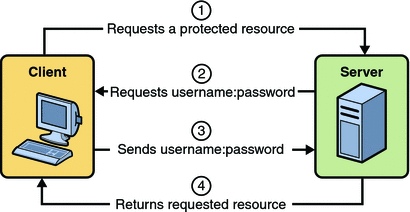
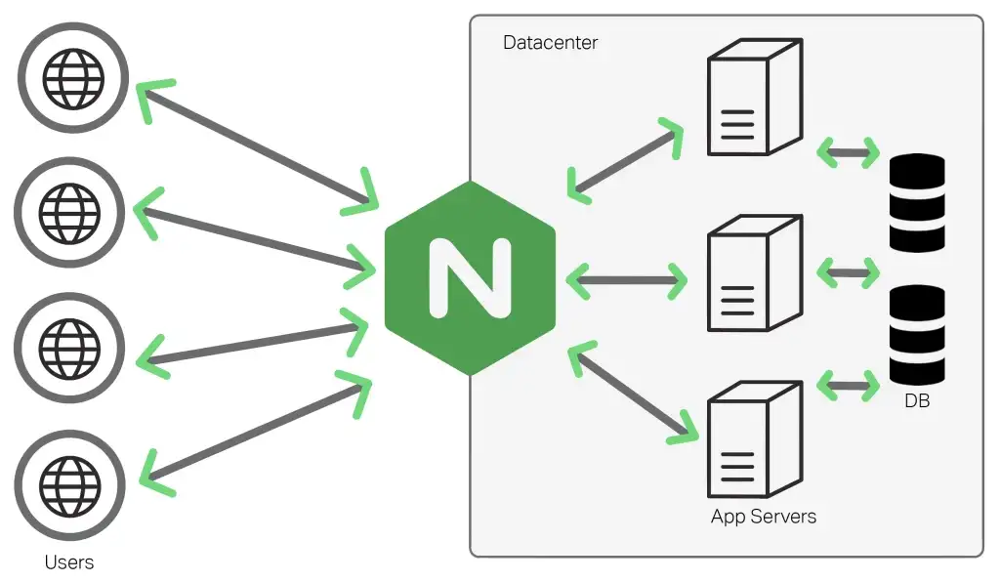
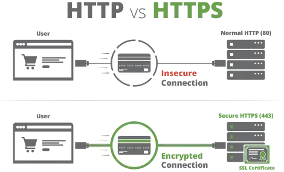
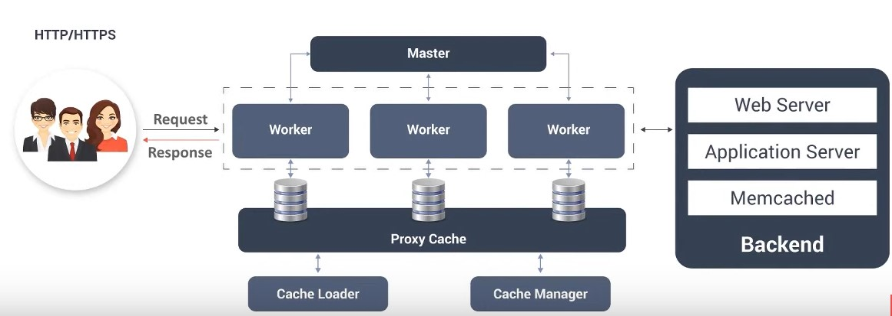

# WEB SERVER

https://www.geeksforgeeks.org/what-is-nginx-web-server-and-how-to-install-it/

https://www.geeksforgeeks.org/how-to-deploy-web-applications-using-nginx-on-remote-server-ubuntu-based-set-2/

# NGINX
https://www.aosabook.org/en/nginx.html
https://www.youtube.com/watch?v=1ndlRiaYiWQ

nginx is a free, open-source, high-performance HTTP server and reverse 
proxy and an IMAP/POP3 proxy server. Nginx is known for its high 
performance, stability, rich feature set, simple configuration, 
and low resource consumption.

Nginx is built to offer low memory usage and high concurrency. 
Rather than creating new processes for each web request, Nginx uses an 
asynchronous, event-driven approach where requests are handled in a 
single thread.

         request

client ---------> server

        response

       <---------

proxy server is a go‑between or intermediary server that forwards 
requests for content from multiple clients to different servers across 
the Internet. A reverse proxy server is a proxy server that typically 
sits behind the firewall in a private network and directs client requests 
to the appropriate backend server. A reverse proxy provides an additional 
level of abstraction and control to ensure the smooth flow of network 
traffic between clients and servers.

## nginx 
- an open source software
- web server for reverse proxying, caching and load balancing
- provides HTTP server capabilities
- designed for maximum performance and stability
- functions a proxy server for email (IMAP, POP3 and SMTP)
- uses a non-threaded and event-driven architecture
- event driven model, asyncronous 

### architecture

MASTER 
 
  |
 
WORKER, WORKER, WORKER (can be more then one)

master : reading and validating configuration (in general)

cache loader 

cache Manager : cache expiration and invalidation

###### CACHING 

## why use NGINX 
- ease of installation and maintaenance
- reduces the wait time for users 
- improves performance
- load balancing 
- offers scalability
- on the fly upgrades : patch and update without having downtime

# CONFIGURATONS SETTINGS
-> the core setting of NGINX are mainly configured in the \textbf{nginx.conf}
file. The configuration file is mainly structured into Contexts

Contexts : event contexts, and http contexts 

:::
worker_processes : setting that define the number of worker_processes 
that nginx will use, usually the same as cpu cores (in general). 
nginx : single threaded 

worker_connections : maximum number of simultaneusly connections for each
worker_processes. 

access_log & error_log : logger :: for debugging or traubleshooting

gzip : compression of nginx response ::::::: need more reading 

## how to install nginx 

https://syed-r-ali.medium.com/setting-up-a-ufw-secured-nginx-reverse-proxy-with-http-authentication-and-tls-certificates-from-b1103d67779f
https://syed-r-ali.medium.com/setting-up-a-ufw-secured-nginx-reverse-proxy-with-http-authentication-and-tls-certificates-from-b1103d67779f

1. install nginx 
    update ur server 
    dnf check-update (but fedora do some automatic update i think)
    dnf install nginx
2. adjust firewall
    : enabling firewall 
        
        sudo ufw enable :: does fedora has it??
        
        UFW (Uncomplicated firewall)
        is a front-end for netfilter, which aims to 
        make it easier for people unfamiliar with 
        firewall concepts. Ufw provides a framework 
        for managing netfilter as well as manipulating the firewall.
        
        https://docs.fedoraproject.org/en-US/quick-docs/firewalld/
        
        : install UFW first : for ease of use on managing software firewalls 
        
        https://installati.one/fedora/34/ufw/

        https://www.howtogeek.com/devops/how-to-secure-your-linux-server-with-a-ufw-firewall/
        
        -> update yum databases with dnf 
        sudo dnf makecache --refresh

        ->installing ufw
        sudo dnf -y install ufw
        
        ->listing all the aplication config that ur firewall knows
        sudo ufw app list
        
        https://stackoverflow.com/questions/61879041/how-can-nginx-be-added-to-ufw-nginx-is-not-appearing-in-the-ufw-lst

        
    
3. check ur server 
4. manage the nginx process 
        
        sudo chmod -R 777 *
        
        scp -r * 0.0.0.0:/var/www/test ::: 0.0.0.0 : use the ip address of 
        the remote server if u use one, cause i deploy it on localhost

